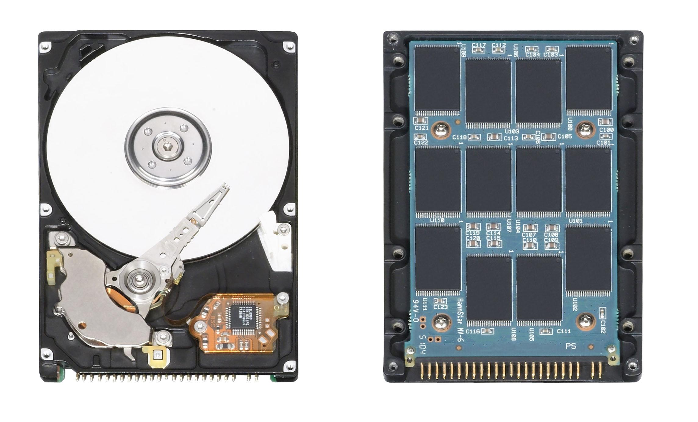

Introdução
==========

## Sistema de computação

- Funcionamento
    - Entrada
    - Processamento
    - Saída

. . .

- Componentes (Hardware)
    - Dispositivos de entrada/saída
    - Dispositivos de armazenamento
    - Processador
    - Memória

## Exemplos

- Propósito geral
    - Computadores pessoais
    - _Smartphones_
    - _Tablets_

. . .

- Propósito específico
    - Eletrodomésticos
    - Automóveis
    - Controle industrial

Dispositivos de entrada/saída
=============================

## Dispositivos de entrada

- Fornecem dados para serem processadas e armazenados

- Exemplos
    - Teclado
    - Mouse
    - Microfone
    - Câmera
    - Sensores

## Dispositivos de saída

- Apresentam dados recuperados do armazenamento e resultados do processamento

- Exemplos
    - Monitor
    - Impressora
    - Auto falante
    - Atuadores

## Dispositivos de entrada e saída

- Adaptadores de rede
- Tela sensível ao toque
- Dispositivos de armazenamento

Dispositivos de armazenamento
=============================

## Dispositivos de armazenamento

- Retêm dados para recuperação posterior

- Tecnologia
    - Eletrônico
        - ROMs (memória apenas para leitura)
        - SSD (disco de estado sólido)
    - Magnético
        - Disquetes (discos flexíveis)
        - HDD (discos rígidos)
    - Óptico
        - CD
        - DVD

## Dispositivos de armazenamento

## Dispositivos de armazenamento

## Dispositivos de armazenamento

- SSD
    - Mais rápido
    - Menor capacidade
    - Mais caro
- HDD
    - Mais lento
    - Maior capacidade
    - Mais barato

Processador e memória
=====================

## Processador e memória

- Memória principal
    - Armazena informações para uso imediato
    - Volátil (requer energia para manter os dados armazenados)

. . .

- Processador (CPU ou unidade central de processamento)
    - Registradores
        - Armazena os operandos e os resultados das operações
    - Unidade lógica e aritmética (ULA)
        - Lê os operados dos registradores
        - Executa operações
        - Grava o resultado nos registradores
    - Unidade de controle
        - Coordena a leitura das instruções da memória e execução pela ULA

## Conjunto de instruções

- Cada processador executa um conjunto específico de instruções
    - X86, AMD64 (computadores em geral)
    - Arm, Aarch64 (dispositivos portáteis)
    - Mips (roteadores)

Atividades
==========

## Atividades

@. Identifique os componentes do seu computador ou _smartphone_:
    - Tipo de tecnologia e capacidade dos dispositivos de armazenamento
    - Dispositivos de entrada
    - Dispositivos de saída
    - Tamanho da memória principal
    - Tipo de processador

@. Identifique em sua casa um dispositivo que contenha um sistema computacional
   de propósito específico e tente explicar:
    - Quais são as entrada do sistema
    - Qual é o processamento que o sistema realiza
    - Quais são as saídas do sistema

## Atividades

Responda:

@. Qual a utilidade de um sistema computacional sem dispositivos de saída?

@. Qual a utilidade de um sistema computacional sem dispositivos de entrada?

@. Qual é a pergunta cuja a resposta é 42?
