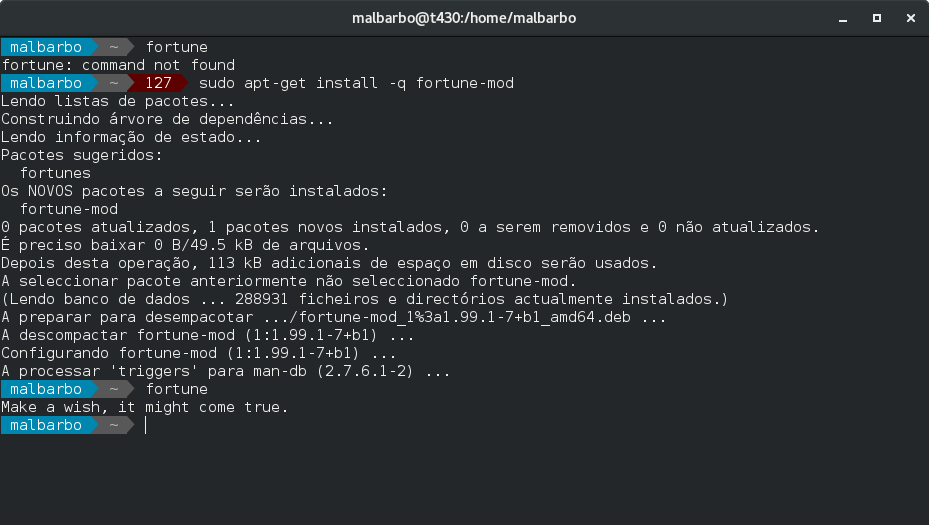
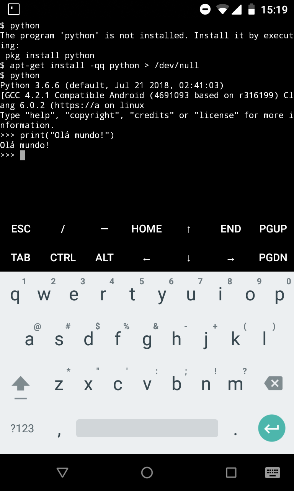

Introdução
==========

## Software

- Coleção de dados e instruções que dizem o que o computador (hardware) deve fazer


## Licença

- Todo o software é distribuído sobre um licença de uso

. . .

- Proprietários
    - Foco nas restrições
    - Geralmente tem a execução restrita, não podem ser redistribuídos, modificados, etc
    - Suporte ao usuário geralmente fornecido pela empresa que vende/distribui o software

. . .

- Livres
    - Foco nas liberdades
    - Os usuários são livres para executar, redistribuir, modificar, estudar o código, etc
    - Suporte ao usuário geralmente fornecido pela comunidade de usuários e desenvolvedores


## Tipos de software

- Software de sistema
- Software aplicativos

. . .

![Camadas de um sistema computacional \newline
\href{https://commons.wikimedia.org/wiki/File:Operating_system_placement.svg}
{Por Golftheman [CC BY-SA 3.0] from Wikimedia Commons}
](imagens/software-camadas.pdf){ height=4.5cm }


Software de sistema
===================

## Software de sistema

- Sistema operacional
    - Gerencia os recursos do sistema
    - Provê serviços comuns para outros softwares

    . . .

    - Exemplos
        - Linux (Android, Debian GNU/Linux, Ubuntu, etc)
        - MacOS (Ios)
        - Windows

. . .

- Utilitários
    - Ajudam a analisar, configurar e otimizar o sistema

    . . .

    - Exemplos
        - Antivírus
        - Gerenciadores de pacotes
        - Desfragmentadores de disco


## Shell 

- A iteração entre sistema operacional e o usuário é feita através de um
  _Shell_
- Nos dispositivos moveis, o termo Lançador é usado ao invés de Shell


## Shell 

- Gráficos
    - Manipulação de janelas
    - Geralmente utilizam a metáfora de área de trabalho
    - Facilidade de uso e aprendizado
    - Menos poderosos

. . .

{ width=8cm }

## Shell 

- Textuais
    - Comandos descritos por texto
    - Mais difícil de aprender e usar
    - Mais agilidade
    - Mais poderoso

. . .

<div class="columns">
  <div class="column" width="60%">
{ width=7cm } 
  </div>
  <div class="column" width="30%">
{ width=3cm }
  </div>
</div>


Softwares aplicativo
====================


## Software aplicativo (ou apenas aplicativo ou ainda app)

- Realiza um conjunto de funções e tarefas que atendem as necessidades do usuário

- Exemplos
    - Editores de texto
    - Planilhas eletrônicas
    - Navegadores da internet


Desenvolvimento de software
===========================

## Desenvolvimento de software

- Em geral os programas são descritos de forma textual usando uma linguagem de
  programação

- Uma linguagem de programação pode ser
  - Compilada
    - C/C++
    - Java
    - Pascal
  - Interpretada
    - Python
    - Javascript
    - Lua

## Compilação

- Um compilador transforma o código (texto) do programa em um arquivo
  diretamente executável pelo processador
- Execução eficiente
- Ciclo de desenvolvimento lento (tem que esperar o compilador)

    . . .

    - Código do programa

        ```c
        #include <stdio.h>
        int main() {
          printf("Olá mundo!\n");
        }
        ```

    - Compilação seguida da execução

        ```bash
        $ cc -o ola ola.c
        $ ./ola
        Olá mundo
        ```

## Interpretação pura

- Um interpretador lê o código do programa e executa diretamente as
  instruções descritas nele
- Execução menos eficiente
- Ciclo de desenvolvimento mais rápido (não precisa esperar o compilador)

    . . .

    - Código do programa

        ```python
        print("Olá mundo!")
        ```

    - Execução direta pelo interpretador

        ```bash
        $ python ola.py
        Olá mundo
        ```


Atividades
==========

## Atividades

@. Identifique o sistema operacional do seu computador ou _smartphone_. Inclua a
versão, o desenvolvedor e o tipo de licença.

@. Liste os softwares livres que você utiliza.

@. Experimente um shell textual no seu computador ou _smartphone_ e relate como
foi a sua experiência.

@. Experimente um shell gráfico alternativo no seu computador ou _smartphone_ e
relate como foi a sua experiência.

## Atividades

@. Experimente algum software utilitário no seu computador ou _smartphone_ e
relate como foi a sua experiência. Inclua a identificação e o propósito do
software.

@. Selecione três softwares que você utiliza e pesquise em quais linguagens de
programação eles foram escritos.

@. Selecione três softwares proprietários que você utiliza e pesquise
alternativas em software livre.

@. Experimente o interpretador interativo do Python disponível em
\url{https://www.python.org/shell/}. Digite algumas expressões aritméticas
seguida de enter. Digite `print("")` com algum texto entre as aspas. O que
acontece?
