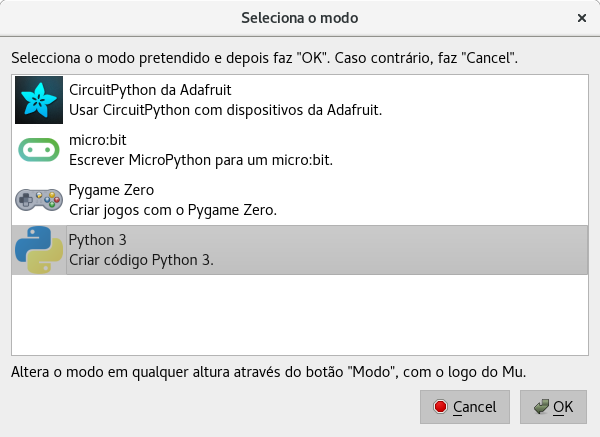

Introdução
==========

## Introdução

Uma linguagem de programação é mais do que um meio para instruir o computador
a fazer tarefas. Uma linguagem também serve como um meio para organizar
e expressar as nossas ideias sobre processos.

## Introdução

Todo linguagem de programação fornece:

- Tipos de dados e operações primitivas

    - São as entidades fundamentais da linguagem

- Meios de combinação

    - Como elementos compostos são construídos a partir de outros elementos

- Meios de abstração

    - Como os elementos compostos podem ser nomeados e manipulados como uma
      unidade


A linguagem de programação Python
=================================

## A linguagem de programação Python

- Python é uma linguagem de programação de propósito geral simples e ao mesmo
  tempo poderosa

- Usado por grandes empresas como Google e Yahoo!

- Também é usado por cientistas para cálculos numéricos (com a biblioteca
  [NumPy](http://www.numpy.org/) entre outras)


## A linguagem de programação Python

- Vantagens em relação ao Pascal, C e C++

    - Sintaxe mais simples

    - Interpretada (é mais fácil interagir e testar os programas)

    - Tipagem dinâmica

    - Gerência automática de memória

    - Biblioteca padrão extensa


## A linguagem de programação Python

- Desvantagens em relação ao Pascal, C e C++

    - Os programas são geralmente mais lentos e consomem mais memória

    - Os erros de tipo são detectados apenas durante a execução do programa


## O editor Mu

\center Um editor simples de código Python para iniciantes

\center \url{https://codewith.mu/}


## O editor Mu

{ width=7cm }


## O editor Mu


## O editor Mu

- Área de **interação**

    - Digite expressões (pequenos trechos de código), pressione enter, o Python
      irá avaliar a expressão e exibir o resultado

        ```python
        >>> 3 + 4 * 2
        11
        ```

- Área de **definições**

    - Para fazer novas definições crie um novo arquivo ("Novo")

    - Digite as definições e salve o arquivo ("Guardar")

    - Execute o arquivo ("Correr")

    - Teste as novas definições na janela de interações

    - Pare a execução ("Parar")


Tipos e operações com números
=============================

## Tipos e operações com números

Podem ser

- Inteiros (`int`)

- Ponto flutuante (`float`) - representação aproximada de números reais

- Complexos, frações e decimais (não estudaremos estes tipos)


## Tipos e operações com números

- Operações aritméticas

    ```python
    >>> 3 + 2     # soma
    5
    >>> 4 - 8     # subtração
    -4
    >>> 3 * 6     # multiplicação
    18
    ```

## Tipos e operações com números

- Operações aritméticas

    ```python
    >>> 7 / 3  # divisão
    2.3333333333333335
    >>> 7 // 3 # divisão pelo piso
               # descarta a parte fracionária
    2
    >>> 7 % 3  # resto da divisão pelo piso
    1
    >>> 9.0 // 2.5
    3.0
    >>> 9.0 % 2.5
    1.5
    ```


## Tipos e operações com números

- Operações aritméticas

    ```python
    >>> pow(2, 3) # exponenciação
    8
    >>> 2 ** 3    # exponenciação
    8
    >>> - 4       # menos unário
    -4
    >>> abs(-5)   # valor absoluto
    5
    ```


## Tipos e operações com números

- Podemos compor expressões assim como fazemos na matemática

    ```python
    >>> 3 + 4 * 2
    11
    >>> 2 + 4 / 2 ** 3
    2.5
    ```


## Tipos e operações com números

- O Python utiliza a mesma precedência que estamos acostumados na matemática.
  Use o acrônimo PEMDAS para lembrar

    - **P**arênteses
    - **E**xponenciação
    - **M**ultiplicação e **D**ivisão
    - **A**dição e **S**ubtração

- Operadores com a mesma precedência são avaliados da direita para a esquerda,
  exceto a exponenciação


## Tipos e operações com números

- Exemplo

    ```python
    >>> 3 + 4 * 2
    11
    >>> (3 + 4) * 2
    14
    >>> 2 + 4 / 2 ** 3
    2.5
    >>> ((2 + 4) / 2) ** 3
    9
    ```


## Tipos e operações com números

- Qual é o resultado das seguintes expressões?

    ```python
    15 // 7
    15 % 7
    12 // 27
    12 % 27
    3 * 4 - 5 / 8 // 3
    8 / 4 / 2
    2 - 4 ** 3 / 9 % 5
    ```


## Tipos e operações pré-definidas

- Conversões de números

    ```python
    >>> int(3.4)   # Transforma um valor para int
    3
    >>> int(3.5)
    3
    >>> int(3.6)
    3
    ```


## Tipos e operações pré-definidas

- Conversões de números

    ```python
    >>> round(3.4) # Faz arredondamento de um número
    3
    >>> round(3.5)
    4
    >>> round(3.6)
    4
    >>> float(12)  # Transforma um valor para float
    12.0
    ```


Operações com cadeia de caracteres
==================================

## Operações com cadeia de caracteres

- Uma cadeira de caracteres (_string_) é usada geralmente para armazenar
  informações simbólicas, como por exemplo palavras e textos

- Uma cadeia de caracteres é escrito em Python entre aspas simples ou dupla

    ```python
    >>> 'casa'
    'casa'
    >>> "gota d'agua"
    "gota d'agua"
    ```


## Operações com cadeia de caracteres

- Assim como existem operações pré-definidas para números, também existem
  operações pré-definidas para cadeira de caracteres

    ```python
    >>> 'casa' + ' da ' + 'sogra'
    'casa da sogra'
    >>> 'abc' * 3
    'abcabcabc'
    >>> 'y' + 'a' * 10 + 'h'
    'yaaaaaaaaaah'
    >>> len('física')
    6
    ```


## Operações com cadeia de caracteres

- Conversão de números para cadeia de caracteres

    ```python
    >>> str(123)
    '123'
    >>> str(12.3)
    '12.3'
    ```

- Conversão de cadeia de caracteres para números

    ```python
    >>> int('123')
    123
    >>> float('12.3')
    12.3
    ```


Operações com valores booleanos
==================================

## Operações com valores booleanos

- Existem dois valores booleanos: `True` e `False`

- Operações `or`

    ```python
    >>> False or False
    False
    >>> False or True
    True
    >>> True or False
    True
    >>> True or True
    True
    ```


## Operações com valores booleanos

- Operação `and`

    ```python
    >>> False and False
    False
    >>> False and True
    False
    >>> True and False
    False
    >>> True and True
    True
    ```


## Operações com valores booleanos

- Operação `not`

    ```python
    >>> not False
    True
    >>> not True
    False
    ```


Operações relacionais
=====================

## Operações relacionais

- Operações relacionais

    ```python
    >>> 3 > 1 + 2       # maior
    False
    >>> 1 + 2 >= 2 + 1  # maior ou igual
    True
    >>> 4 - 1 < 4       # menor
    True
    >>> 4 <= 4          # menor ou igual
    True
    >>> 2 - 1 == 3      # igual
    False
    >>> 4 * 2 != 8      # diferente
    False
    ```


Erros
=====

## Erros

Os erros em programação podem ser classificados em três tipos:

- Erros sintáticos

- Erros em tempo de execução

- Erros lógicos


## Erros sintáticos

Quando o texto do programa não está de acordo com as regras. Os erros
sintáticos são informados antes da execução do programa.

```python
>>> 2a
  File "<stdin>", line 1
    2a
     ^
SyntaxError: invalid syntax
>>> 4 * 5)
  File "<stdin>", line 1
    4 * 5)
         ^
SyntaxError: invalid syntax
```


## Erros em tempo de execução

São chamados assim porque ocorrem durante a execução do programa. Em geral
ocorrem porque alguma expressão não faz sentido, como por exemplo, soma um
número com uma cadeia de caracteres.

\small

```python
>>> 2 + "3"
Traceback (most recent call last):
  File "<stdin>", line 1, in <module>
TypeError: unsupported operand type(s) for +: 'int' and 'str'
>>> int("abc")
Traceback (most recent call last):
  File "<stdin>", line 1, in <module>
ValueError: invalid literal for int() with base 10: 'abc'
```


## Erros lógicos

O programa executa até o fim mas o resultado gerado não é o esperado.

```python
# Vamos calcular a raiz quadrada de 2!
>>> 2 ** 1 / 2
1
```


Criação de funções
==================

## Criação de funções

Uma das formas de compor novas operações e a criação de funções. A forma
inicial de criação de funções é:

\ 

```python
def nome_da_funcao(parametro1, parametro2, ...):
    return expressao
```


## Exemplo de criação de funções

Defina uma função que calcula o total de segundos de uma determinado tempo dado
em horas, minutos e segundos.

\ 

```python
def segundos(horas, minutos, segundos):
    return 3600 * horas + 60 * minutos + segundos
```

\ 

Exemplos de uso

```python
>>> segundos(1, 10, 12)
4212
```

## Exemplo de criação de funções

Defina uma função que calcule o valor da hipotenusa dados os valores dos
catetos de um triângulo retângulo.

\ 

```python
def hipotenusa(x, y):
    return (x ** 2 + y ** 2) ** 0.5
```

\ 

Exemplos de uso

```python
>>> hipotenusa(3.0, 4.0)
5.0
```

## Exemplo de criação de funções

Defina uma função que crie um texto justificado a direita a partir do texto
e do limite de caracteres.

\ 

```python
def justifica_direita(texto, limite):
    return ' ' * (limite - len(texto)) + texto
```

\ 

Exemplos de uso

```python
>>> justifica_direita('casa', 10)
'      casa'
```


## Criação de funções

\center Criar novas funções pode parecer difícil, mas nos veremos uma "receita de
projeto" que nos guiará na criação de novas funções.


Criação de tipos de dados
=========================

## Criação de tipos de dados

Uma das formas de criar novos tipos de dados e a criação de tuplas nomeadas.
A forma inicial de criação de novos tipos é:

```python
from typing import NamedTuple

class NomeDoTipo(NamedTuple):
    campo1: tipo1
    campo2: tipo2
    ...
```


## Exemplo de criação de tipos de dados

Crie um novo tipo de dado que represente um ponto no plano cartesiano.

\small

```python
from typing import NamedTuple

class Ponto(NamedTuple):
    x: float
    y: float
```

\ 

Exemplos de uso

```python
>>> Ponto(2.0, 3.0)
Ponto(x=2.0, y=3.0)
>>> Ponto(2.0, 3.0) == Ponto(3.0, 2.0)
False
```


## Exemplo de uso de novos tipos de dados

Defina uma função que calcule a distância entre dois pontos no plano cartesiano.

\ 

\small

```python
def distancia(p1, p2):
    return ((p1.x - p2.x) ** 2 + (p1.y - p2.y) ** 2) ** 0.5
```

\ 

Exemplos de uso

```python
>>> distancia(Ponto(2.0, 7.0), Ponto(6.0, 4.0))
5.0
```


## Leitura recomendada

- \href{https://penseallen.github.io/PensePython2e/}{Livro Pense em Python} 2ª edição. Allen B. Downey

    - \href{https://penseallen.github.io/PensePython2e/01-jornada.html}{Capítulo
      1 - A jornada do programa}, Seções 1.1, 1.2, 1.4 - 1.7

    - \href{https://penseallen.github.io/PensePython2e/https://penseallen.github.io/PensePython2e/03-funcoes.html}{Capítulo 3 - Funções}, Seções 3.1 - 3.3.

    - \href{https://penseallen.github.io/PensePython2e/06-funcoes-result.html}{Capítulo
      6 - Funções com resultados}, Seções 6.1 - 6.4.
