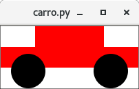

# Introdução

## Introdução

- Programa

    - Coleção de funções e constantes

    - Uma função principal, definida em termos das outras funções


## Introdução

- Programas não interativos (em lote)

    - Consome toda a entrada de uma vez e computada o resultado


## Introdução

- Programas interativos

    - Consome alguma entrada, computa, produz alguma saída, consome mais
      entrada, e assim por diante

    - Chamamos o surgimento de alguma entrada de evento

    - Programas interativos são orientados a eventos

    - A funções que são executadas em resposta aos eventos são chamadas de
      manipuladores de eventos


## Introdução

- Vamos usar imagens para criar "mundos" interativos

- Uma imagem é um dado visual e retangular

- Pode ser uma foto, um desenho, uma figura geométrica enquadrada


## Introdução

### ATENÇÃO

Para criar imagens e mundos interativos é necessário baixar o arquivo
`creation.py` da página da disciplina e colocar na pasta de aquivos do mu.


# Criação e operações com imagens


## Primitivas

- Criação de imagens

    - `circle`, `ellipse`, `triangle`, `square`, `rectangle`, `text`, `pixmap`

- Combinação de imagens

    - `beside`, `above`, `overlay`, `place`

- Outras funções

    - `image_view`, `image_save`, `image_width`, `image_height`

    - `color`, `fill`


## `circle`

Um círculo sem preenchimento

```python
>>> circle(30, 'red')
```


Um círculo com preenchimento

```python
>>> circle(20, fill('blue'))
```


## `circle`

Um círculo com preenchimento e transparência

```python
>>> circle(20, fill('blue', 0.5))
```


## `ellipse`

Uma elipse sem preenchimento

```python
>>> ellipse(60, 30, 'black')
```


Uma elipse com preenchimento

```python
>>> ellipse(30, 60, fill('blue'))
```


## `ellipse`

Uma elipse com preenchimento e transparência

```python
>>> ellipse(30, 60, fill('blue', 0.75))
```


## `triangle`

Um triângulo equilátera com preenchimento

```python
>>> triangle(40, fill('tan'))
```


## `square`

Um quadrado com preenchimento

```python
>>> square(40, fill('slateblue'))
```


Um quadrado sem preenchimento

```python
>>> square(50, 'darkmagenta')
```


## `rectangle`

Um retângulo sem preenchimento

```python
>>> rectangle(40, 20, 'black')
```


Um retângulo com preenchimento

```python
>>> rectangle(20, 40, fill('blue'))
```


## `text`

Um texto

```python
>>> text('Fundamentos', 12, 'olive')
```


Um texto maior

```python
>>> text('Computação', 20, 'indigo')
```


## `pixmap`

Imagem de arquivo

```python
>>> pixmap('cat-girl.png')
```


## `beside`

Várias elipses uma ao lado da outra

```python
>>> beside(
    'center', # alinhamento
    ellipse(20, 70, fill('gray')),
    ellipse(20, 50, fill('darkgray')),
    ellipse(20, 30, fill('dimgray')),
    ellipse(20, 10, fill('black')),
)
```


## `beside`

Várias elipses uma ao lado da outra

```python
>>> beside(
    'top',    # alinhamento pelo topo
    ellipse(20, 70, fill('gray')),
    ellipse(20, 50, fill('darkgray')),
    ellipse(20, 30, fill('dimgray')),
    ellipse(20, 10, fill('black')),
)
```


## `beside`

Várias elipses uma ao lado da outra

```python
>>> beside(
    'bottom', # alinhamento pela base
    ellipse(20, 70, fill('gray')),
    ellipse(20, 50, fill('darkgray')),
    ellipse(20, 30, fill('dimgray')),
    ellipse(20, 10, fill('black')),
)
```


## `above`

Várias elipses uma abaixo da outra

```python
>>> above(
    'center', # alinhamento
    ellipse(70, 20, fill('gold')),
    ellipse(50, 20, fill('goldenrod')),
    ellipse(30, 20, fill('darkgoldenrod')),
    ellipse(10, 20, fill('sienna')),
)
```


## `above`

Várias elipses uma abaixo da outra

```python
>>> above(
    'left',   # alinhamento pela esquerda
    ellipse(70, 20, fill('gold')),
    ellipse(50, 20, fill('goldenrod')),
    ellipse(30, 20, fill('darkgoldenrod')),
    ellipse(10, 20, fill('sienna')),
)
```


## `above`

Várias elipses uma abaixo da outra

```python
>>> above(
    'right',  # alinhamento pela direita
    ellipse(70, 20, fill('gold')),
    ellipse(50, 20, fill('goldenrod')),
    ellipse(30, 20, fill('darkgoldenrod')),
    ellipse(10, 20, fill('sienna')),
)
```


## `overlay`

Um retângulo sobreposto a uma elipse

```python
>>> overlay(
    'center', # alinhamento no eixo x
    'center', # alinhamento no eixo y
    rectangle(30, 60, fill('orange', 0.5)),
    ellipse(60, 30, fill('purple'))
)
```


## `overlay`

Um retângulo sobreposto a uma elipse

```python
>>> overlay(
    'right',  # alinha as figuras pela direita
    'center',
    rectangle(30, 60, fill('orange', 0.5)),
    ellipse(60, 30, fill('purple'))
)
```


## `overlay`

Um retângulo sobreposto a uma elipse

```python
>>> overlay(
    'left',   # alinha as figuras pela esquerda
    'center',
    rectangle(30, 60, fill('orange', 0.5)),
    ellipse(60, 30, fill('purple'))
)
```


## `overlay`

Um retângulo sobreposto a uma elipse

```python
>>> overlay(
    'center',
    'top',    # alinha as figuras pelo topo
    rectangle(30, 60, fill('orange', 0.5)),
    ellipse(60, 30, fill('purple'))
)
```


## `overlay`

Um retângulo sobreposto a uma elipse

```python
>>> overlay(
    'center',
    'bottom', # alinha as figuras pela base
    rectangle(30, 60, fill('orange', 0.5)),
    ellipse(60, 30, fill('purple'))
)
```


## `overlay`

Um retângulo sobreposto a uma elipse

```python
>>> overlay(
    'left',   # alinha as figuras pela esquerda
    'bottom', # alinha as figuras pela base
    rectangle(30, 60, fill('orange', 0.5)),
    ellipse(60, 30, fill('purple'))
)
```


## `overlay`

Mais que duas imagens

```python
>>> overlay(
    'center',
    'center',
    circle(5, fill('red')),
    circle(10, fill('black')),
    circle(15, fill('red')),
    circle(20, fill('black')),
    circle(25, fill('red')),
)
```


## `place`

Coloca um círculo sobre um retângulo

```python
>>> place(
    circle(20, fill('black')),
    'center', 25,
    'center', 50,
    rectangle(200, 100, fill('gray'))
)
```


## `place`

Coloca um círculo sobre um retângulo

```python
>>> place(
    circle(20, fill('black')),
    'center', 100,
    'center', 50,
    rectangle(200, 100, fill('gray'))
)
```


## `place`

Coloca um círculo sobre um retângulo

```python
>>> place(
    circle(20, fill('black')),
    'center', 190,
    'center', 50,
    rectangle(200, 100, fill('gray'))
)
```


## Visualização e gravação

\scriptsize

<div class="columns">
<div class="column" width="50%">
```python
from creation import *

CORPO_CARRO = above(
    'center',
    rectangle(100, 30, fill('red')),
    rectangle(200, 30, fill('red')),
    rectangle(200, 30, fill('white'))
)
RODA = circle(25, fill('black'))
CARRO = place(
    RODA,
    'center', 160,
    'center', 65,
    place(
        RODA,
        'center', 40,
        'center', 65,
        CORPO_CARRO
    )
)
```
</div>
<div class="column" width="50%">
Visualiza a imagem `CARRO`

```python
>>> image_view(CARRO)
```

\ 

{ width=3cm }

\ 

Salva a imagem `CARRO` no arquivo `carro.svg`
```
>>> image_save(CARRO, 'carro.svg')
```
</div>
</div>


## Tamanho

```python
>>> image_width(rectangle(10, 30, 'red'))
10
>>> image_height(rectangle(10, 30, 'red'))
30
>>> image_width(pixmap('cat-girl.png'))
68
>>> image_height(pixmap('cat-girl.png'))
90
```


## Cores

- Sistema de cores RGBA (**R**ed, **G**reen, **B**lue, **A**lpha)

    - Cada valor no intervalo 0 a 255 (1 byte)

    - Alpha: 0 $\rightarrow$ transparente, 255 $\rightarrow$ totalmente opaco

    - Exemplo

        ```python
        violeta = color(238, 130, 238, 120)
        ```

- Nomes pré-definidos


## Cores


# Criação de mundos interativos

## Criação de mundos

- Definição do estado do mundo

- Função que cria uma imagem a partir do estado do mundo

- Manipuladores de eventos

    - Transforma o mundo a partir de um evento de relógio (tick) ou
      pressionamento de uma tecla do teclado


## Criação de mundos

<div class="columns">
<div class="column" width="50%">
\tiny

```python
from creation import *

def desenho(mundo):
    '''
    Mundo -> Imagem
    Cria uma imagem do mundo.
    '''
    return ...

def on_tick(mundo):
    '''
    Mundo -> Mundo
    Manipula evento de relógio.
    Transforma o mundo com o passar do tempo.
    '''
    return ...

def on_key(mundo, tecla):
    '''
    Mundo, Tecla -> Mundo
    Manipula eventos do teclado.
    Transforma o mundo quando uma tecla é pressionada.
    '''
    return ...

def main(mundo_inicial)
    return create(mundo_inicial, desenho, on_tick=on_tick, on_key=on_key)
```
</div>
<div class="column" width="50%">
\scriptsize

- Mundo são os dados que representam o estado do mundo

- As funções `on_tick` e `on_key` são opcionais

- A função `main` permite iniciar o programa de forma conveniente a partir da
  janela de interações do editor mu
</div>
</div>


## Criação de mundos

- A função `create` é responsável por

    - Armazenar o estado do mundo

    - Exibir o desenho do mundo

    - Receber os eventos do sistema operacional e executar o manipulador
      apropriado


## Funcionamento da função `create`

- Armazena o estado inicial do mundo em $w_0$

- Exibe a imagem $\texttt{desenho}(w_0)$

- Para cada evento $i = 1, 2, 3, \dots$ gerado pelo sistema operacional faça

    - Se o evento é um _tick_ de relógio, então

        - $w_i = \texttt{on\_tick}(w_{i-1})$

    - Se o evento é uma tecla pressionada, então

        - $w_i = \texttt{on\_key}(w_{i-1}, \texttt{tecla})$

    - Exibe a imagem $\texttt{desenho}(w_i)$


## Projeto de mundos

- Definir constantes para todas as propriedades do mundo que não se alteram com
  o passar do tempo e são necessárias para criar a imagem do mundo

    - Constantes físicas: tamanho, velocidade, etc

    - Constantes gráficas

- Definir um tipo de dado que representada o estado do mundo com as
  propriedades que se alteram com o passar do tempo


## Projeto de mundos

- Implementar a função de desenho e testar manualmente

- Implementar usando a receita de projeto as funções de manipulação de eventos

- Definir uma função principal (não precisa de projeto ou teste, é apenas uma
  forma conveniente de iniciar o programa a partir do editor mu)


## Exemplo

Expansão

- Triângulo no centro da tela que aumenta de tamanho com o passar do tempo

- Quando a tecla espaço é pressionada, o triângulo retorna ao tamanho inicial


## Exemplo

Bate e volta

- Círculo que se move para esquerda ou direita com o passar do tempo

- Quando o círculo chega em uma extremidade, muda de direção

- As teclas mais e menos controlam a velocidade do círculo


## Exemplo

Controle

- Círculo que se move em uma direção específica com o passar do tempo

- Não "ultrapassa" as laterais da janela

- As teclas `'left'`, `'right'`, `'up'` e `'down'` controlam a direção do
  círculo


# Atividades

## Atividades

@. Defina a imagem de um semáforo.

@. Defina a imagem de um gato (usando apenas formas geométricas, use
   a criatividade!).

@. Defina uma imagem como a imagem abaixo:


## Atividades

@. Escreva um programa que exiba um semáforo funcionando.

@. Escreve um programa que exiba um círculo se deslocando ao longo de um
   circunferência (Dica: coordenadas polares).


## Referências

- Baseado no
  [Image guide](https://docs.racket-lang.org/teachpack/2htdpimage-guide.html)
  do livro [How to design programs](https://htdp.org/), 2nd Edition.
